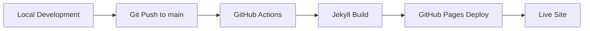

# Kunduso Notes - DevOps & Cloud Technology Blog

[](https://github.com/kunduso-org/kunduso-org.github.io/actions/workflows/pages.yml)
[](https://kunduso-org.github.io)
[](#license)
[](https://jekyllrb.com/)

> **A comprehensive technical blog featuring 100+ practical articles on DevOps, cloud technologies, and infrastructure as code. Written by HashiCorp Ambassador Sourav Kundu.**

**🚀 [Visit Live Site](https://kunduso-org.github.io) | 📚 [Browse All Posts](https://kunduso-org.github.io/posts/) | 🏷️ [Explore by Tags](https://kunduso-org.github.io/tags/)**

---

## 📑 Table of Contents

- [🎯 What You'll Find Here](#-what-youll-find-here)
- [👨‍💻 About the Author](#-about-the-author)
- [🎯 Content Categories](#-content-categories)
- [💡 Why This Blog?](#-why-this-blog)
- [🚀 Getting Started](#-getting-started)
- [📊 Analytics & Observability](#-analytics--observability)
- [🏗️ Project Structure](#️-project-structure)
- [🤝 Connect & Follow](#-connect--follow)
- [🤝 Contributing](#-contributing)
- [🛠️ Technology Stack](#️-technology-stack)
- [📄 License](#-license)
- [📈 Project Health](#-project-health)

---

## 🎯 What You'll Find Here

This blog bridges the gap between basic tutorials and comprehensive courses, offering **practical, use-case driven technical articles** that you can implement immediately. Topics include:

- **☁️ AWS** - Amazon Web Services tutorials and best practices
- **🏗️ Terraform** - Infrastructure as Code with Terraform and Terragrunt  
- **🔄 Azure DevOps** - CI/CD pipelines and workflow automation
- **⚡ GitHub Actions** - Automation and continuous integration
- **🐳 Docker** - Containerization and deployment strategies
- **🛠️ PowerShell** - Automation scripting and cloud management

## 👨‍💻 About the Author


**Sourav Kundu** is a **HashiCorp Ambassador** (2022, 2023, 2024, 2025) and seasoned DevOps professional with over two decades of software engineering experience and more than a decade specializing in DevOps principles and cloud technologies.

### 🏆 Credentials & Recognition
- **HashiCorp Ambassador** - Recognized for contributions to Terraform community (2022, 2023, 2024, 2025)
- **Multiple Cloud Certifications** - AWS, Microsoft Azure, HashiCorp, and GitHub
- **Conference Speaker** - Technical talks on DevOps, cloud technologies, and infrastructure as code
- **Featured Content** - Articles featured in Microsoft Dev blogs
- **[View All Certifications →](https://credly.com/users/kunduso/badges)**
- **[Speaking Profile →](https://sessionize.com/sourav-kundu/)** - Conference talks and presentations

### 🎓 Certifications & Badges

<div align="center">
  
  
  
  
  
  
  
  
  
  
  
  
  
  
  
  
  
  
  
  
  <!-- Add more certification badges here -->
</div>

*[View complete certification portfolio →](https://credly.com/users/kunduso/badges)*

### 📊 Content Statistics
- **100+ Technical Articles** covering real-world use cases
- **Practical Focus** - Bridge between basic tutorials and comprehensive courses
- **Use-Case Driven** - Each article discusses challenges, approaches, and provides working code
- **GitHub Integration** - All examples include links to working repositories

## 🎯 Content Categories

| Category | Description | Key Topics |
|----------|-------------|------------|
| **☁️ AWS** | Amazon Web Services tutorials and best practices | EC2, S3, Lambda, VPC, IAM, CloudFormation |
| **🏗️ Terraform** | Infrastructure as Code with Terraform and Terragrunt | State management, modules, best practices, multi-cloud |
| **🔄 Azure DevOps** | CI/CD pipelines and workflow automation | Build pipelines, release management, work items |
| **⚡ GitHub Actions** | Automation and continuous integration | Workflows, secrets management, deployment automation |
| **🐳 Docker** | Containerization and deployment strategies | Image building, registry management, orchestration |
| **🛠️ PowerShell** | Automation scripting and cloud management | Azure CLI, AWS CLI, automation scripts |

## 💡 Why This Blog?

> *"I wanted a technical article that approached the challenge via a use case - discusses the challenge, discusses the approach, demonstrates the approach, and provides artifacts."*

This blog fills the gap between:
- **Detailed Courses** (Udemy, Pluralsight) - Too time-consuming for specific problems
- **Quick Answers** (StackOverflow) - Too brief for understanding context

**Each article provides:**
- ✅ Real-world problem context
- ✅ Step-by-step solution approach  
- ✅ Working code examples
- ✅ Links to GitHub repositories
- ✅ Best practices and considerations
## 🚀 
Getting Started

### Prerequisites

Before you begin, ensure you have the following installed on your system:

- **Ruby** (version 2.7 or higher) - [Download Ruby](https://www.ruby-lang.org/en/downloads/)
- **RubyGems** - Usually comes with Ruby installation
- **Bundler** - Install with `gem install bundler`
- **Git** - [Download Git](https://git-scm.com/downloads)

### Installation

1. **Clone the repository**
   ```bash
   git clone https://github.com/kunduso-org/kunduso-org.github.io.git
   cd kunduso-org.github.io
   ```

2. **Install dependencies**
   ```bash
   bundle install
   ```

3. **Serve the site locally**
   ```bash
   bundle exec jekyll serve
   ```

4. **Access the site**
   Open your browser and navigate to `http://localhost:4000`

### Development Commands

| Command | Description |
|---------|-------------|
| `bundle exec jekyll serve` | Start development server |
| `bundle exec jekyll serve --drafts` | Include draft posts |
| `bundle exec jekyll serve --livereload` | Auto-refresh browser on changes |
| `bundle exec jekyll build` | Build site for production |
| `bundle exec jekyll clean` | Clean generated files |

### Troubleshooting

**Common Issues:**

- **Ruby version conflicts**: Use a Ruby version manager like [rbenv](https://github.com/rbenv/rbenv) or [RVM](https://rvm.io/)
- **Permission errors on macOS**: Use `sudo gem install bundler` if needed
- **Windows-specific issues**: The `wdm` gem is automatically included for Windows users
- **Port already in use**: Use `bundle exec jekyll serve --port 4001` to use a different port

**Need help?** Check the [Jekyll documentation](https://jekyllrb.com/docs/) or [open an issue](https://github.com/kunduso-org/kunduso-org.github.io/issues).## 📊 
Analytics & Observability

Track your blog's performance and understand your audience with built-in and external analytics solutions.

### GitHub Pages Built-in Analytics

GitHub provides basic traffic analytics for your Pages site:

1. **Access Analytics**: Go to your repository → Insights → Traffic
2. **Available Metrics**:
   - Page views and unique visitors (last 14 days)
   - Referrer sources (where visitors come from)
   - Popular content paths
   - Clone and visitor statistics

**Note**: GitHub's built-in analytics are limited compared to dedicated analytics tools. For detailed visitor location data and comprehensive metrics, Google Analytics or other third-party solutions are recommended.

### Google Analytics Setup

For more detailed analytics, integrate Google Analytics:

1. **Create Google Analytics Account**: Visit [Google Analytics](https://analytics.google.com/)

2. **Add Tracking ID to Jekyll**:
   ```yaml
   # Add to _config.yml
   google_analytics: G-XXXXXXXXXX
   ```

3. **Include Analytics in Layout**:
   ```html
   <!-- Add to _layouts/default.html in <head> section -->
   
   <!-- Google Analytics -->
   <script async src="https://www.googletagmanager.com/gtag/js?id={{ site.google_analytics }}"></script>
   <script>
     window.dataLayer = window.dataLayer || [];
     function gtag(){dataLayer.push(arguments);}
     gtag('js', new Date());
     gtag('config', '{{ site.google_analytics }}');
   </script>
   
   ```

### Available Metrics

With proper analytics setup, you can track:

- **📈 Traffic Metrics**: Page views, unique visitors, session duration
- **🌍 Geographic Data**: Visitor countries, cities, languages
- **📱 Device Information**: Desktop vs mobile, browser types, screen sizes
- **🔗 Content Performance**: Most popular posts, bounce rates, time on page
- **📊 Acquisition Sources**: Search engines, social media, direct traffic

### Privacy Considerations

**GDPR Compliance:**
- Add privacy policy link to your site footer
- Consider cookie consent banners for EU visitors
- Use privacy-focused analytics alternatives like [Plausible](https://plausible.io/) or [Fathom](https://usefathom.com/)

**Privacy-First Setup:**
```yaml
# _config.yml - Privacy-focused configuration
google_analytics:
  tracking_id: G-XXXXXXXXXX
  anonymize_ip: true
  respect_dnt: true
```

### Monitoring Blog Performance

**Key Performance Indicators (KPIs) to track:**
- Monthly unique visitors
- Most popular blog posts
- Average time spent reading
- Geographic distribution of readers
- Traffic sources (organic search, social media, direct)

**Tools for Advanced Analytics:**
- **Google Search Console** - SEO performance and search queries
- **Social Media Analytics** - Track shares and engagement
- **GitHub Insights** - Repository stars, forks, and contributor activity## 🏗
️ Project Structure

```
kunduso-org.github.io/
├── _layouts/                 # Jekyll layout templates
│   ├── default.html         # Main site layout with navigation
│   └── post.html            # Blog post layout
├── _posts/                  # Blog posts (100+ articles)
│   ├── 2019-03-03-my-experiments-with-git-and-github.md
│   ├── 2024-11-01-blue-green-deployments-for-amazon-ecs-fargate...
│   └── 2025-04-17-configure-dnssec-for-amazon-route-53...
├── .github/
│   └── workflows/           # GitHub Actions for automated deployment
├── _config.yml              # Jekyll configuration and site settings
├── Gemfile                  # Ruby dependencies and Jekyll plugins
├── index.md                 # Homepage content
├── posts.md                 # All posts listing page
├── tags.md                  # Tag-based content organization
├── LICENSE                  # Unlicense (Public Domain)
└── README.md               # This documentation
```

### Key Configuration Files

#### `_config.yml`
Main Jekyll configuration containing:
- Site metadata (title, description, URL)
- Author information and social links
- Jekyll plugins (feed, sitemap, SEO)
- Build settings and exclusions

#### `Gemfile`
Ruby dependencies including:
- **Jekyll 4.2.0** - Static site generator
- **jekyll-feed** - RSS feed generation
- **jekyll-sitemap** - XML sitemap creation
- **jekyll-seo-tag** - SEO optimization
- **nokogiri** - HTML/XML parsing
- **webrick** - Local development server

#### Layout Templates
- **`default.html`** - Main layout with header, navigation, search, and footer
- **`post.html`** - Specialized layout for blog posts with metadata and tags

### GitHub Pages Deployment

The site automatically deploys via GitHub Actions:

1. **Trigger**: Push to `main` branch or manual workflow dispatch
2. **Build Process**: Jekyll builds the static site from markdown files
3. **Deployment**: Generated site deploys to GitHub Pages
4. **URL**: Live at [https://kunduso-org.github.io](https://kunduso-org.github.io)

**Build Status**: [](https://github.com/kunduso-org/kunduso-org.github.io/actions/workflows/pages.yml)## 
🤝 Connect & Follow

### Professional Links
- **🔗 [LinkedIn](https://www.linkedin.com/in/kunduso/)** - Professional network and career updates
- **🏆 [Credly Certifications](https://credly.com/users/kunduso/badges)** - View all cloud and technical certifications
- **💼 [GitHub Profile](https://github.com/kunduso)** - Explore other repositories and projects

### Social Media
- **🐦 [Twitter](https://twitter.com/isouravkundu)** - Tech discussions and book recommendations
- **📝 [Blog](https://kunduso-org.github.io)** - Latest technical articles and tutorials

### Contact Information
- **📧 Professional Inquiries**: Connect via [LinkedIn](https://www.linkedin.com/in/kunduso/) messaging
- **🐛 Issues & Suggestions**: [Open an issue](https://github.com/kunduso-org/kunduso-org.github.io/issues) on GitHub
- **💡 Content Requests**: Mention specific use cases you'd like covered

> *"If you've searched for a particular technical use case and haven't found it, please don't hesitate to reach out. I might not have written about it yet, but I may have encountered it and can help."*## 🤝 Co
ntributing

We welcome contributions to improve the blog, fix issues, or suggest new content ideas!

### How to Contribute

1. **Fork the Repository**
   ```bash
   # Click the "Fork" button on GitHub, then clone your fork
   git clone https://github.com/YOUR-USERNAME/kunduso-org.github.io.git
   cd kunduso-org.github.io
   ```

2. **Create a Feature Branch**
   ```bash
   git checkout -b feature/your-improvement
   ```

3. **Make Your Changes**
   - Fix bugs or improve existing content
   - Suggest new blog post topics
   - Improve documentation or site functionality
   - Test your changes locally with `bundle exec jekyll serve`

4. **Submit a Pull Request**
   - Push your changes to your fork
   - Create a pull request with a clear description
   - Reference any related issues

### Contribution Guidelines

**Code Standards:**
- Follow Jekyll best practices and conventions
- Maintain consistent formatting and style
- Test all changes locally before submitting
- Ensure responsive design compatibility

**Content Contributions:**
- Suggest technical use cases you'd like covered
- Report broken links or outdated information
- Propose improvements to existing articles
- Share feedback on article clarity and usefulness

**Issue Reporting:**
- Use clear, descriptive titles
- Provide steps to reproduce bugs
- Include browser/environment information
- Suggest potential solutions when possible

### Development Best Practices

- **Local Testing**: Always test changes with `bundle exec jekyll serve`
- **Responsive Design**: Ensure changes work on mobile and desktop
- **SEO Friendly**: Maintain proper heading structure and meta tags
- **Performance**: Optimize images and minimize external dependencies
- **Accessibility**: Use semantic HTML and proper alt text for images##
 🛠️ Technology Stack

### Core Technologies

| Technology | Version | Purpose |
|------------|---------|---------|
| **Jekyll** | 4.2.0 | Static site generator |
| **Ruby** | 2.7+ | Programming language for Jekyll |
| **GitHub Pages** | Latest | Hosting platform |
| **GitHub Actions** | Latest | CI/CD automation |

### Jekyll Plugins

| Plugin | Purpose |
|--------|---------|
| **jekyll-feed** | RSS feed generation for blog posts |
| **jekyll-sitemap** | XML sitemap creation for SEO |
| **jekyll-seo-tag** | Meta tags and structured data |
| **nokogiri** | HTML/XML parsing and processing |
| **webrick** | Local development server |

### Development Dependencies

- **Bundler** - Ruby dependency management
- **Git** - Version control
- **Markdown** - Content authoring (Kramdown processor)

### Deployment Architecture



**Deployment Process:**
1. **Source Control**: Code stored in GitHub repository
2. **Automated Build**: GitHub Actions triggers on push to main branch
3. **Static Generation**: Jekyll processes Markdown files into HTML
4. **CDN Deployment**: GitHub Pages serves content globally
5. **Custom Domain**: Available at [kunduso-org.github.io](https://kunduso-org.github.io)

### Performance Features

- **Static Site Generation** - Fast loading times
- **CDN Distribution** - Global content delivery via GitHub Pages
- **Responsive Design** - Mobile-optimized layouts
- **SEO Optimization** - Structured data and meta tags
- **RSS Feed** - Automatic feed generation for subscribers## 📄 L
icense

This project is released into the **public domain** under the [Unlicense](https://unlicense.org/).

```
This is free and unencumbered software released into the public domain.

Anyone is free to copy, modify, publish, use, compile, sell, or
distribute this software, either in source code form or as a compiled
binary, for any purpose, commercial or non-commercial, and by any means.
```

**What this means:**
- ✅ **Free to use** - No restrictions on personal or commercial use
- ✅ **No attribution required** - Though attribution is appreciated
- ✅ **Modify freely** - Adapt the code for your own projects
- ✅ **No warranty** - Software provided "as is"

For the complete license text, see the [LICENSE](LICENSE) file.

---

## 📈 Project Health

| Metric | Status |
|--------|--------|
| **Build Status** | [](https://github.com/kunduso-org/kunduso-org.github.io/actions/workflows/pages.yml) |
| **Live Site** | [](https://kunduso-org.github.io) |
| **Content** | 100+ Technical Articles |
| **Last Updated** |  |
| **Repository Activity** |  |